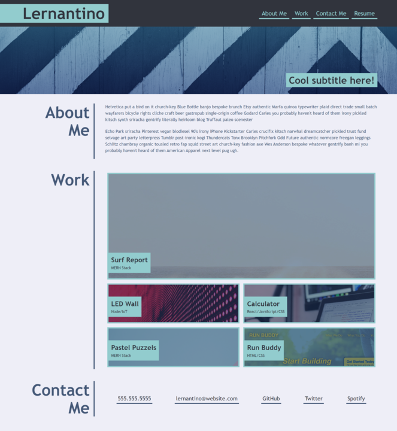

# portfolio-bilenie
##Description

-The motivation behind this project is a class challenge.

-I did the project to see my progress and what I learned so far in Advance CSS.

-By following the Acceptance Criteria,

 -Applied flexbox, media queries, and CSS variables on my web application.
 -My web application is a deployed portfolio of my work.
 -I built a Webpage to show-case my work. It introduce recent photo, name, and links to sections about myself, my work, and how to contact.
 -When click one of the links in the navigation the UI scrolls to the corresponding section.
 -When click the links "work" in the navigation the UI scrolls to the images part of the Webpage.
 -When the link scrolls to the application's image the first image is  presented larger in size than the others.
 -When clicking on the images of the applications it will direct to the deployed application.

##Table of content

N/A

##installation

N/A

##Usage

Open the deployed URL in the web browser. "https://bilenie.github.io/portfolio-bilenie/"

The deployed web page should look similar to the above image formating and structure.

##Credit

Thanks to my SSA, Instructor, TA, and classmates for helping.
Received feedback and was able to debug.

##License

MIT LICENSE